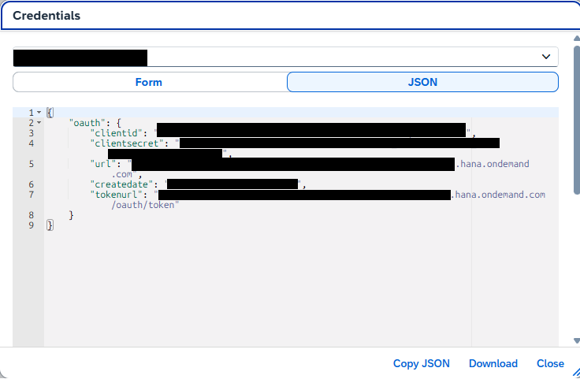

# Welcome to inco

**inco** tests scripts and provides the resources to the associated SAP integration flow.<br/>
To be used in CICD pipelines to easily test and upload every script used in you SAP iflow.<br/>
**inco** will search a manifest file inco.yaml where it is invoked.

# Getting started

## Install Dependencies

Install groovy<br/>
```sudo apt-get install groovy```<br/>
Then verify installation<br/>
```groovy --version```


## Install inco

```go install https://github.com/itevia/inco/cmd/inco@latest```

or

```sudo curl -L https://github.com/itevia/inco/releases/download/0.0.2/inco-linux-amd64 -o /usr/local/bin/inco && sudo chmod +x /usr/local/bin/inco```


## Required Configuration

### Where to find information

Client ID, Client Secret, Token URL, URL can be found in **SAP BTP Cockpit -> Instances and Subscriptions -> Instances**.<br/>
Display or create the Key related to the **Service SAP Process Integration Runtime**, plan **api**.


Clicking on key(s), the information will be displayed:<br/>



### Environment variables

| Field Name | Additional info    |
|------------|--------------------|
| CPI_CLIENT_ID       |  
| CPI_CLIENT_SECRET   | 


### Project configuration file - Manifest

Create a inco.yaml file at root of your project

#### Root Object

| Field Name | Type | Additional info    |
|------------|------|--------------------|
| tokenURL       |string| Required 
| url      |string| Required
| testPaths       |[string]| Required - list of paths to find test scripts to run
| uploadScripts      |[Iflow]| Required - list of UploadScript

#### Iflow Object

| Field Name | Type | Additional info |
|------------|------|-----------------|
| id       |string| Required - 
| version      |string| Required - `active` or `x.x.x`
| scripts     |[Script]| Required - 

#### Script Object

| Field Name | Type | Additional info |
|------------|------|-----------------|
| id       |string| Required - 
| type      |string| Required - `groovy`
| path     |string| Required - path to find script to upload


## Manifest usage preview
Below you can see a manifest **inco** will use as input.<br>
The manifest must be at project root.

```
tokenURL: https://<tenant>.authentication.eu10.hana.ondemand.com
url: https://<tenant>.hana.ondemand.com
testPaths:
  - tools/runTests.groovy
uploadScripts:
  - id: <IFLOW ID>
    version: active
    scripts:
      - id: script1.groovy
        type: groovy
        path: src/script1.groovy
      - id: script2.groovy
        type: groovy
        path: src/script2.groovy
```
